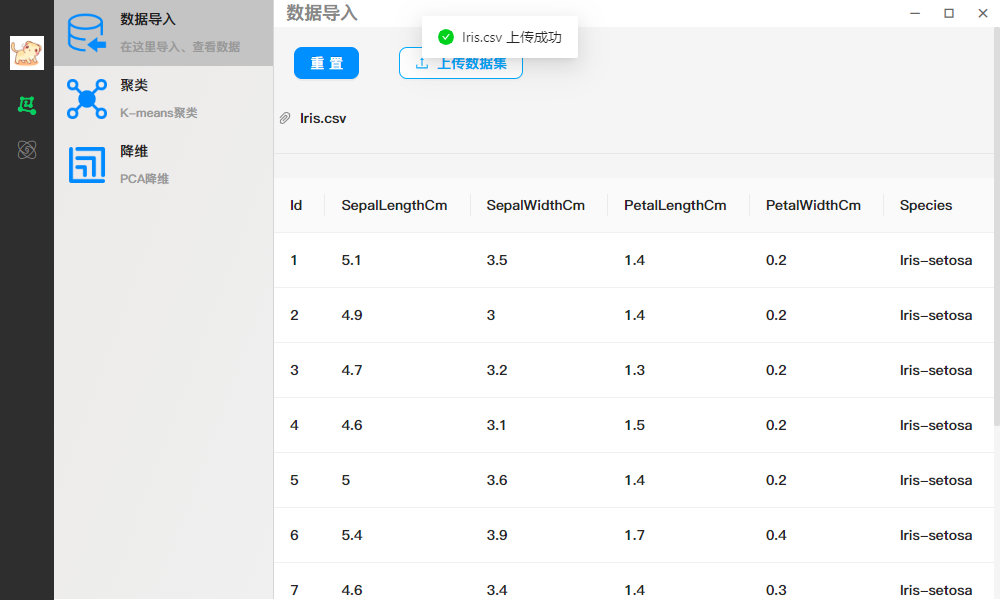
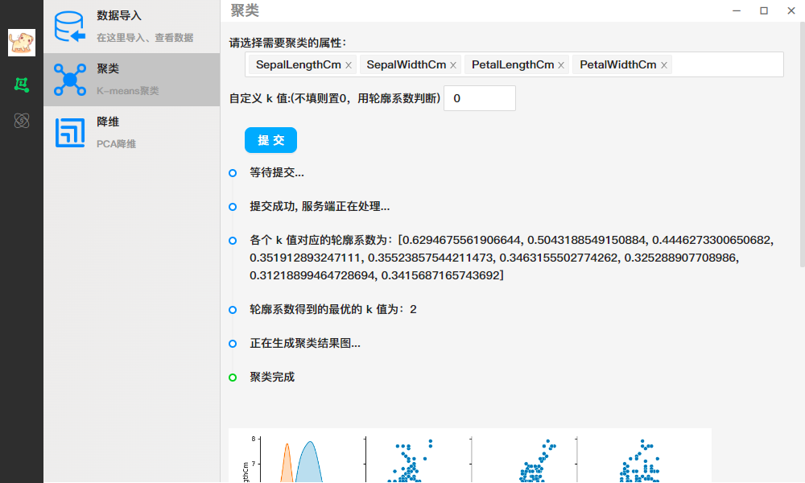
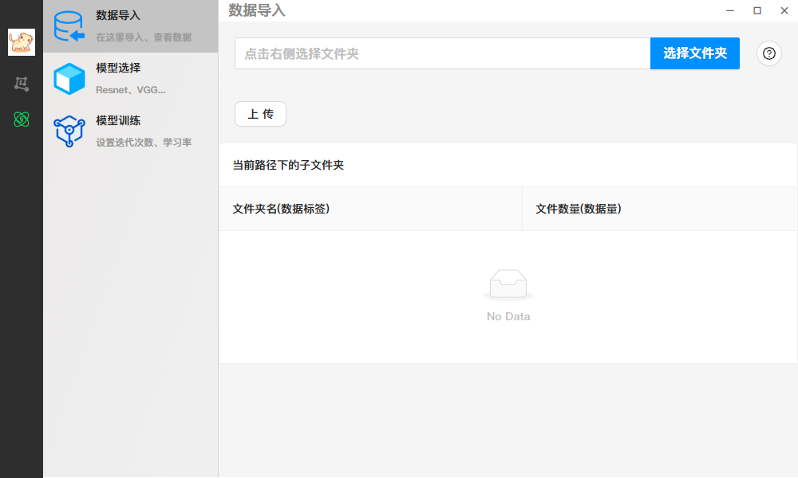

# Machine learning gadget developed with Electron and Vue

用Electron和Vue开发的机器学习小工具

## Setup and Run

### Install Dependencies

In the root directory
```bash  
npm install
```

### Run

Run `backend.py` in the `backend` folder in Python, and then `npm run dev` in the root directory.

用 Python 运行 backend 文件夹中的 `backend.py`，然后在根目录下 `npm run dev` 即可。

## screenshot






